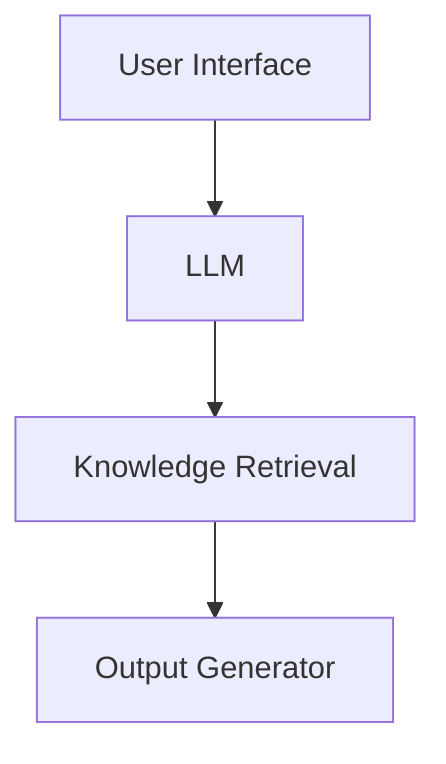

# Regulatory AI for Structured Execution (RAISE)

Reducing regulatory response cycle time through AI-assisted analysis planning and knowledge retrieval.

## Contents

- [Regulatory AI for Structured Execution (RAISE)](#regulatory-ai-for-structured-execution-raise)
  - [Contents](#contents)
  - [Overview](#overview)
  - [Why This Matters](#why-this-matters)
  - [Product Vision](#product-vision)
  - [Core Concept](#core-concept)
    - [Input](#input)
    - [AI Output](#ai-output)
  - [Hackathon Scope](#hackathon-scope)
    - [1. IR Question Interpreter](#1-ir-question-interpreter)
    - [2. Knowledge Search](#2-knowledge-search)
    - [3. Response Draft Builder](#3-response-draft-builder)
      - [Objective](#objective)
      - [Data Sources](#data-sources)
      - [Methodology](#methodology)
      - [Outputs](#outputs)
      - [Responsible Teams](#responsible-teams)
  - [Stretch Feature](#stretch-feature)
    - [Task Coordination Board](#task-coordination-board)
  - [Recommended Demo Flow](#recommended-demo-flow)
  - [Practical Architecture](#practical-architecture)
  - [Prototype Data Sources](#prototype-data-sources)
  - [Long-Term Value for SPA](#long-term-value-for-spa)
  - [What Good Looks Like for the Prototype](#what-good-looks-like-for-the-prototype)
  - [Product name](#product-name)

## Overview

This project is a hackathon prototype for an AI copilot that helps SPA teams prepare responses to Health Authority requests such as FDA Information Requests (IRs), EMA Lists of Questions (LoQs), and similar regulatory queries.

The core idea is simple: instead of starting from scratch each time a new request arrives, the tool reads the question, identifies the likely data and analyses involved, finds related prior work, and produces a structured starting point for the response.

## Why This Matters

Today, regulatory response preparation is slow, manual, and hard to coordinate.

Typical workflow today:

1. Regulatory forwards the request.
2. Clinical and statistics teams interpret the ask.
3. SPA searches across prior TFLs, programs, SAPs, and ADaM assets.
4. Analysts decide what needs to be generated.
5. Work is distributed manually across teams.

Current pain points:

- High time pressure
- Knowledge scattered across many files and sources
- Rework of analyses that may already exist
- Weak traceability from request to output
- Difficult coordination across global teams

## Product Vision

**Regulatory AI for Structured Execution (RAISE)** is the planning copilot for SPA in this repository.

Its job is to turn a regulatory question into an execution plan by helping teams:

1. Understand the request quickly
2. Identify impacted datasets and analyses
3. Reuse relevant prior outputs where possible
4. Draft a structured response outline
5. Coordinate work and ownership

The goal is to reduce cycle time while improving consistency, traceability, and collaboration.

## Core Concept

### Input

Regulatory question text, for example:

> Provide subgroup analysis of VMS frequency reduction by age group and baseline severity for Weeks 4, 12, and 24.

### AI Output

The tool should convert that request into a practical response plan.

Example output:

| Category | Example Output |
| --- | --- |
| Detected request type | Subgroup efficacy analysis |
| Impacted datasets | ADSL, ADVS or ADTTE, derived endpoint dataset |
| Suggested analyses | MMRM by subgroup, responder analysis |
| Possible existing outputs | OASIS-1 subgroup table, OASIS-2 responder analysis |
| Suggested deliverables | Table, figure, supporting listing |
| Response structure | Analysis description, data sources, methods, results summary |

This shortens the discovery phase and gives the team a shared starting point immediately.

## Hackathon Scope

The prototype should stay focused on three core features.

### 1. IR Question Interpreter

Purpose: Turn unstructured regulatory text into a clear analysis request.

Input:

- Regulatory question text

Expected extraction:

- Endpoint
- Subgroup or population
- Timepoints
- Analysis type
- Likely statistical model
- Expected output types

Example:

| Field | Example |
| --- | --- |
| Request type | Subgroup efficacy analysis |
| Endpoint | VMS frequency |
| Population | Age groups |
| Timepoints | Weeks 4, 12, 24 |
| Statistical model | MMRM |
| Outputs | Tables and figures |

Why it matters: this gives the team immediate clarity on what the request is asking for.

### 2. Knowledge Search

Purpose: Find similar prior work that can be reused or adapted.

Potential sources:

- SAPs
- TFL shells
- Prior IR responses
- Study reports

Example output:

- Similar analysis found: OASIS-1 Table 14.3.2.1
- Similar analysis found: OASIS-2 subgroup analysis
- Recommendation: likely reuse candidate

Why it matters: this reduces duplicated effort and helps teams avoid reinventing analyses.

### 3. Response Draft Builder

Purpose: Generate a response skeleton the team can refine.

Example draft structure:

#### Objective

Provide subgroup analysis of VMS frequency reduction by age group.

#### Data Sources

- ADSL
- ADEFF

#### Methodology

MMRM model with treatment, visit, and baseline terms.

#### Outputs

- Table X
- Figure Y

#### Responsible Teams

- SPA
- Biostatistics
- Medical Writing

Why it matters: the team starts with a usable draft instead of a blank page.

## Stretch Feature

### Task Coordination Board

If time allows, the tool can auto-generate a simple execution board.

Example:

| Task | Owner | Status |
| --- | --- | --- |
| Create MMRM table | Programmer | Pending |
| Generate figures | Programmer | Pending |
| Draft narrative | Medical Writing | Pending |

Why it matters: coordination becomes visible and traceable across contributors.

## Recommended Demo Flow

The prototype demo should show a simple, linear user journey:

1. User pastes IR text
2. AI interprets the request
3. AI identifies impacted analyses and datasets
4. AI surfaces similar previous outputs
5. AI generates a structured response outline
6. AI produces an execution plan, optionally with task ownership

If the demo can complete this flow smoothly, it will tell a clear story.

## Practical Architecture

This does not need enterprise infrastructure for the hackathon.



Suggested stack:

| Layer | Simple Option |
| --- | --- |
| UI/UX | next.js + shadcn |
| Model | Bayer myGenAssist v2 via OpenAI SDK (`gpt-5` default) |
| Retrieval | RAG or in-context-learning |
| Output generation | Template-based markdown or structured JSON |

## Prototype Data Sources

For the hackathon, dummy or anonymized materials are enough.

Suggested inputs:

- Sample SAP
- Example IR text
- Example TFL shells
- Fake dataset metadata
- Prior response examples

Even 5 to 10 documents are enough to demonstrate retrieval and reuse.

## Long-Term Value for SPA

Over time, this could expand beyond FDA IRs and support:

- FDA Information Requests
- EMA Lists of Questions
- PMDA queries
- Labeling updates
- Publication analyses

Potential long-term benefits:

- 30 to 40 percent faster IR preparation
- Less dependency on a small number of SMEs
- More standardized response structures
- Better traceability from question to analysis to deliverable

## What Good Looks Like for the Prototype

By the end of the hackathon, the prototype should be able to:

1. Parse a realistic regulatory question
2. Identify the likely analysis components
3. Suggest at least one relevant prior output or reuse candidate
4. Generate a response outline the team could actually edit
5. Present the result in a way that is easy to demo and explain

## Product name

**Regulatory AI for Structured Execution (RAISE)** — system and UI name.

Shorthand for presentations and demos:

- RAISE
- Regulatory AI for Structured Execution

## Local Development

### Prerequisites

- Node.js 20.9+
- npm

### Install

```bash
npm install
```

### Build The Local Evidence Corpus

```bash
npm run ingest
```

This generates `data/copilot/evidence-corpus.json` from:

- `README.md`
- `docs/examples/define.xml`
- `docs/examples/programs/*.sas`

Run it again whenever those source materials change.

### Optional Environment

The MVP works without external credentials by using deterministic interpretation and plan-generation fallbacks.

If you want server-side Bayer myGenAssist v2 refinement through the OpenAI SDK, set:

```bash
export MGA_TOKEN=your_token_here
```

Optional model override:

```bash
export MGA_MODEL=your_model_slug
```

### Run

```bash
npm run dev
```

### Test

```bash
npm run test
```

### Build

```bash
npm run build
```

### Demo Flow

1. Paste a regulatory question or choose a seeded demo prompt.
2. Review the typed interpretation of the ask.
3. Inspect the ranked repo evidence and the reason each source matched.
4. Review the generated internal response plan with assumptions, open questions, and evidence gaps.

### Current MVP Scope

This repository now contains a hackathon-ready **RAISE** planning copilot (**Regulatory AI for Structured Execution**) that:

- interprets a narrow, credible set of regulatory asks
- grounds retrieval in the repo brief, `define.xml`, and curated SAS examples
- generates a traceable internal response plan instead of final authority-facing wording
- keeps weak evidence visible through warnings, open questions, and evidence gaps

Out of scope for this MVP:

- SAS execution
- uploads or external document ingestion
- vector databases or external retrieval services
- task-board coordination and auth flows
