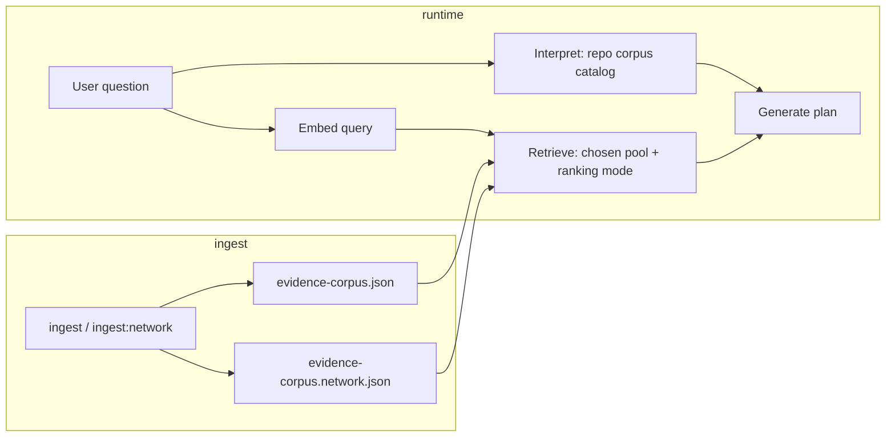

# Network share evidence, vector indexing, and UI options

This document records the **Samba / network-share corpus** feature, **retrieval modes**, **UI and design updates**, and **per-file change summaries** for future work.

**Status:** Implementation is in place. Run `npm run test` locally to confirm your environment passes the full Vitest suite.

---

## Table of contents

1. [Executive summary](#executive-summary)
2. [Knowledge retrieval: evidence source (two options)](#knowledge-retrieval-evidence-source-two-options)
3. [Ranking mode (two options)](#ranking-mode-two-options)
4. [How the pieces fit together (flow)](#how-the-pieces-fit-together-flow)
5. [Environment variables and files](#environment-variables-and-files)
6. [Design changes](#design-changes)
7. [Per-file change log (20 entries)](#per-file-change-log-20-entries)
8. [Ideas for future enhancements](#ideas-for-future-enhancements)

---

## Executive summary

- **Repository (demo)** continues to use the bundled `data/copilot/evidence-corpus.json` built from README, `define.xml`, SAS examples, and packaged PDFs (`npm run ingest`).
- **Network share (Samba index)** scans a **mapped UNC folder** (or any path Node can read), chunks text/PDFs into evidence documents, optionally embeds them with **MGA_TOKEN**, and writes **`data/copilot/evidence-corpus.network.json`** (`npm run ingest:network`).
- The UI **Knowledge retrieval** card lets users pick **which corpus** powers the **Evidence** tab and **how** keyword vs vector scores are combined.
- **Interpretation** and **plan-generation prompts** still use the **repository** catalog so request typing stays aligned with demo SAS families; only **evidence retrieval** switches to the network JSON when that option is selected.

---

## Knowledge retrieval: evidence source (two options)

### Option 1: Repository (demo SAS, define.xml, PDFs)

| Aspect | Detail |
|--------|--------|
| **What it is** | The original hackathon corpus shipped with the repo. |
| **Data** | `README.md`, `docs/examples/define.xml`, `docs/examples/programs/*.sas`, configured PDFs under `docs/examples/`. |
| **Built by** | `npm run ingest` → `scripts/build-knowledge-base.ts` → `data/copilot/evidence-corpus.json`. |
| **Runtime** | Loaded via static import in `lib/server/copilot/knowledge-base.ts` (in-memory cache + MiniSearch index). |
| **Best for** | Demos, CI, laptops without corporate shares, predictable “known” programs and metadata. |

### Option 2: Network share (Samba index)

| Aspect | Detail |
|--------|--------|
| **What it is** | A **separate** corpus produced from files on a path the app server can read—typically a **mapped Windows drive** or **UNC** path to Samba (e.g. `\\server\share\...`). |
| **Data** | Recursive scan: **`.sas`, `.txt`, `.pdf` only** (other extensions are ignored). Large files and noisy folders (`node_modules`, `.git`, `.next`, etc.) are skipped. Re-run **`npm run ingest:network`** after this change if you previously relied on `.md` / `.xml` / etc. |
| **Built by** | `npm run ingest:network` → `scripts/build-network-corpus.ts` → **`data/copilot/evidence-corpus.network.json`**. |
| **Runtime** | Read from disk at request time (with mtime-based reload) in `getKnowledgeBase("network")`. |
| **Best for** | Real study or submission folders on a share, without copying them into the git repo. |

### Important difference (same words, different meaning)

- **Repository** = curated **in-repo** evidence used for both **interpretation hints** (program keywords → dataset/output hints) and **retrieval**.
- **Network share** = **your** folder tree, turned into chunked `network-file` documents with embeddings when `MGA_TOKEN` is set. **Retrieval** can use this corpus; **interpretation** still uses the **repository** program catalog so the LLM keeps the same “families” unless you later extend the code to blend catalogs.

The repo includes a **placeholder** `data/copilot/evidence-corpus.network.json` (brief only) so **Network share** works immediately after clone. Replace it by running **`npm run ingest:network`** against your mapped path. If you delete the file, the server **falls back** to the same placeholder in memory and logs a **console warning** (no hard crash).

---

## Ranking mode (two options)

Both modes use **MiniSearch** (keyword) and, when the corpus has embeddings, **cosine similarity** between the **question embedding** and **document embeddings**. The difference is **how scores are combined**.

### Hybrid (keywords + vectors)

- Combines keyword **RRF** (reciprocal rank fusion, K=60) and vector **RRF**, then applies the same **heuristic boosts** as before (dataset/output-family overlap, timepoints, source-type tweaks).
- **Metadata:** `retrievalMetadata.method === "hybrid"` when vectors exist; `"keyword-only"` if no embeddings.

### Vector-first (semantic)

- **Primary signal** is **cosine similarity**; keyword RRF adds only a **small tie-breaker** (implementation: similarity + small multiple of keyword RRF).
- **Metadata:** `retrievalMetadata.method === "vector-primary"` when vectors exist and this mode is selected.
- **Use case:** Large, heterogeneous share folders where filenames and tags may not match regulatory jargon well, but **semantic** overlap is strong.

**Note:** Vector quality depends on **`MGA_TOKEN`** at **ingest** time for the network corpus (and on the embedding API for live query vectors). Without embeddings, both modes effectively behave like **keyword-only** for ranking.

---

## How the pieces fit together (flow)

1. User selects **evidence source** and **ranking mode** in the form (`name="evidencePool"`, `name="retrievalStrategy"`).
2. Server action passes options into `runCopilot` → `retrieveEvidence`.
3. `getKnowledgeBase(evidencePool)` returns corpus + MiniSearch index for that pool.
4. Results include `retrievalMetadata.evidencePool` and `retrievalMetadata.method` for UI and logging.

---

## Environment variables and files

| Variable | Purpose |
|----------|---------|
| `EVIDENCE_SCAN_ROOT` | Root folder to scan for `ingest:network` (default in script: `\\by-swanPRD\swan\root\bhc\3427080`—adjust if your UNC differs; the user message had a typo `swan)` which was **not** used as default). |
| `EVIDENCE_NETWORK_OUTPUT` | Optional override path for the output JSON (default `data/copilot/evidence-corpus.network.json`). |
| `EVIDENCE_NETWORK_CORPUS_PATH` | Optional override for **runtime** load path of the network corpus. |
| `MGA_TOKEN` | Required for embeddings at ingest (and for full LLM interpretation/planning at runtime). |
| `MGA_EMBEDDING_MODEL` | Optional; defaults like the main ingest script. |

**CLI override:** `npx tsx scripts/build-network-corpus.ts "D:\mapped\study"` uses the argument as scan root.

**API (local dev):**

- `POST /api/rebuild-corpus` — repo corpus (`build-knowledge-base.ts`), then clears KB cache.
- `POST /api/rebuild-network-corpus` — network corpus (`build-network-corpus.ts`, long timeout), then clears KB cache.

---

## Design changes

| Area | Change |
|------|--------|
| **Knowledge retrieval card** | New bordered panel above the main grid with a subtle **teal/navy gradient** (`from-[#10384F]/[0.03]`), **uppercase section label**, short instructional copy, and two **native `<select>`** controls (accessible, no new Radix dependency). |
| **Copy / terminology** | “Rebuild Knowledge Base” → **“Rebuild repo index”**; added **“Rebuild network index”** with distinct **tinted button** (`border-[#10384F]/20`, `bg-[#10384F]/[0.04]`) so the two rebuild actions are visually separated. |
| **Status line** | Rebuild summaries prefixed with **“Repo:”** and **“Network:”** when present. |
| **Evidence tab** | When results exist, an **“Active index”** banner shows pool + mode + optional top semantic % (`border-[#00BCFF]/20`, `bg-[#00BCFF]/[0.06]`). |
| **Pipeline explainer** | Step and tech copy updated to mention optional Samba corpus, hybrid vs vector-first, and dual JSON artifacts. |
| **Auto-hint** | Switching to **Network share** nudges **Ranking mode** to **Vector-first** if it was Hybrid (still user-overridable). |

---

## Per-file change log (20 entries)

Entries **1–19** are files that were added or modified for this feature. Entry **20** lists related modules that were **not** edited but matter for behavior and future work.

### 1. `lib/server/copilot/schemas.ts`

- Added evidence source type **`network-file`**.
- Added **`evidencePoolSchema`** (`repository` | `network`).
- Extended **`retrievalMetadataSchema.method`** with **`vector-primary`**.
- Added **`evidencePool`** to retrieval metadata (default **`repository`** for parsed payloads).
- Exported type **`EvidencePool`**.

### 2. `lib/server/knowledge/build-network-corpus.ts` *(new)*

- **`createNetworkReadmeBrief`**: synthetic `ReadmeBrief` matching strict Zod literals (`brief:product`, `README.md`).
- **`scanRootToDocuments`**: recursive file walk, skips heavy dirs, size cap, text chunking, PDF via existing **`parsePdfFile`** with `sourceType: "network-file"`.
- **`embeddingInputForDocument`**: text fed to embedding API (title, summary, keywords, truncated `sourceText`).
- **`buildNetworkEvidenceCorpus`**: `datasets: []`, `programs: []`, documents = brief + scanned chunks.
- **`stableChunkId`**: `net:` + short SHA-256 of chunk key for stable IDs.

### 3. `scripts/build-network-corpus.ts` *(new)*

- Loads `.env` like `build-knowledge-base.ts`.
- Resolves scan root: **argv[1]** or **`EVIDENCE_SCAN_ROOT`** or **default UNC**.
- Embeds in batches with **OpenAI SDK** + **MGA** base URL when **`MGA_TOKEN`** set.
- Writes JSON to **`EVIDENCE_NETWORK_OUTPUT`** or default **`data/copilot/evidence-corpus.network.json`**.

### 4. `lib/server/copilot/knowledge-base.ts`

- **Split caches:** repository (static JSON) vs network (disk JSON + **mtime** invalidation).
- **`getKnowledgeBase(evidencePool?)`**: `"repository"` | `"network"`; network throws if file missing.
- **`networkCorpusPath()`**: **`EVIDENCE_NETWORK_CORPUS_PATH`** or default under `data/copilot/`.
- **`clearKnowledgeBaseCache()`**: clears both pools’ corpus + MiniSearch instances (used after rebuild APIs).
- **`getDocumentEmbeddings()`**: unchanged behavior (still **repository** corpus only—see enhancements if you need network embeddings export).

### 5. `lib/server/copilot/retrieve-evidence.ts`

- Accepts **`evidencePool`**, **`retrievalStrategy`** (`hybrid` | `vector-primary`).
- **`buildRetrievalReason`**: branch for **`network-file`**.
- **Vector-first scoring** when embeddings exist: similarity-dominant + small keyword RRF.
- Returns **`retrievalMetadata.method`**: `vector-primary` | `hybrid` | `keyword-only`, plus **`evidencePool`**.
- Exported type **`RetrievalStrategy`**.

### 6. `lib/server/copilot/run-copilot.ts`

- **`CopilotOptions`**: **`evidencePool`**, **`retrievalStrategy`**.
- Passes them into **`retrieveEvidence`**.

### 7. `lib/server/copilot/confidence.ts`

- **`retrievalMethod`** union includes **`vector-primary`**.
- **`computeEvidenceRelevanceScore`**: treats **`vector-primary`** like hybrid when similarities exist; adds an extra reason line for vector-first.

### 8. `app/actions/run-copilot.ts`

- Reads **`evidencePool`** and **`retrievalStrategy`** from **`FormData`** (submitted by the two selects).

### 9. `app/api/rebuild-corpus/route.ts`

- Calls **`clearKnowledgeBaseCache()`** after a successful repo rebuild so the server does not serve stale corpora.

### 10. `app/api/rebuild-network-corpus/route.ts` *(new)*

- Runs **`npx tsx scripts/build-network-corpus.ts`** with **600s** timeout.
- Clears KB cache on success; returns parsed counts from stdout when regex matches.

### 11. `package.json`

- New script: **`ingest:network`**: `tsx scripts/build-network-corpus.ts`.

### 12. `components/copilot/question-form.tsx`

- New props: **`onRebuildNetwork`**, **`networkRebuilding`**, **`networkRebuildResult`**.
- State + UI: **Knowledge retrieval** card, **`name="evidencePool"`** and **`name="retrievalStrategy"`** selects, helper text for Samba/ingest.
- **Rebuild network** button; **Repo / Network** result labels.

### 13. `components/copilot/copilot-workbench.tsx`

- State + **`rebuildNetworkCorpus()`** calling **`/api/rebuild-network-corpus`**.
- Passes new props into **`QuestionForm`**.
- Passes **`retrievalMetadata`** into **`EvidencePanel`**.

### 14. `components/copilot/evidence-panel.tsx`

- Optional **`retrievalMetadata`**; **Active index** banner with pool, mode, top similarity.

### 15. `components/pipeline-explainer.tsx`

- Copy updates for retrieve step, retrieval tech bullet, knowledge base bullet.

### 16. `tests/server/knowledge/build-network-corpus.test.ts` *(new)*

- Temp dir with a **`.txt`** file; asserts **`scanRootToDocuments`** and **`buildNetworkEvidenceCorpus`** shape.

### 17. `tests/server/copilot/schemas.test.ts`

- **`retrievalMetadata`** fixture includes **`evidencePool: "repository"`** for strict parsing.

### 18. `tests/components/copilot-panels.test.tsx`

- Mock **`CopilotResult`** **`retrievalMetadata`** includes **`evidencePool`**.

### 19. `tests/components/copilot-header-and-form.test.tsx`

- **`defaultProps`** extended with **`networkRebuildResult`**, **`networkRebuilding`**.

### 20. Related modules *(no code changes in this feature, but important)*

| File | Why it matters |
|------|----------------|
| `lib/server/copilot/interpret-request.ts` | Calls **`getKnowledgeBase()`** with the default **repository** pool when building **`datasetHints` / `outputFamilyHints`** from program documents. Network-only retrieval does **not** switch this pass. |
| `lib/server/copilot/prompts.ts` | **`buildKnowledgeBaseCatalog()`** uses the **repository** corpus for the interpretation system prompt’s view of families and counts. |
| `lib/server/copilot/generate-plan.ts` | **`humanizeOutputFamily`** looks up program titles in the **repository** corpus. |

---

## Ideas for future enhancements

1. **Interpretation catalog from network** — Optionally merge program-like files into the hint pass in `interpret-request.ts`, or run a second LLM pass with “available file titles” only.
2. **Batch mode** — Thread **`evidencePool` / `retrievalStrategy`** through **`run-batch-copilot.ts`** and the batch UI.
3. **getDocumentEmbeddings** — Parameterize by pool if any feature needs raw embedding maps from the network corpus.
4. **Incremental ingest** — Track file hashes/mtimes in sidecar JSON to avoid full re-embed on every run.
5. **Stricter UNC validation** — Startup check that **`EVIDENCE_SCAN_ROOT`** is readable and log friendly errors on Windows.
6. **Pure vector cutoff** — Option to **drop** hits below a similarity threshold or to exclude docs with **`embedding: null`** in vector-first mode.
7. **Admin-only rebuild APIs** — Protect **`/api/rebuild-*`** in production (auth, secret header, or disable).
8. **i18n** — Extract new strings from **question-form** and **evidence-panel** for localization.

---

## Quick start checklist (for you or your team)

1. Map the Samba share (or use a local folder path).
2. Set **`EVIDENCE_SCAN_ROOT`** (or pass path as CLI arg to `ingest:network`).
3. Set **`MGA_TOKEN`** in `.env` for embeddings.
4. Run **`npm run ingest:network`** (or **Rebuild network index** in the UI against a running dev server).
5. In the app, choose **Network share** + preferred **Ranking mode**, then **Run Copilot**.
6. Open the **Evidence** tab and confirm the **Active index** line matches your selection.

---

*Document generated to match the codebase state that introduced network corpus ingestion and dual-pool retrieval. Update this file when you change env vars, defaults, or UX copy.*
